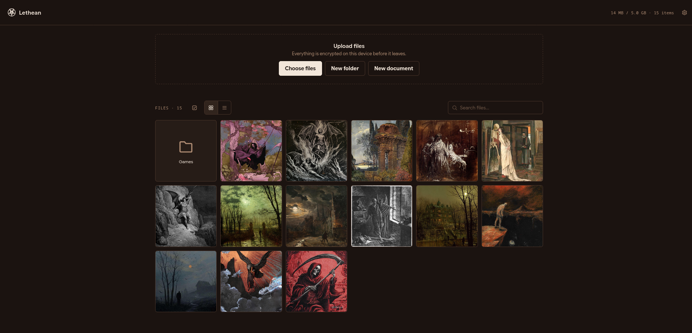
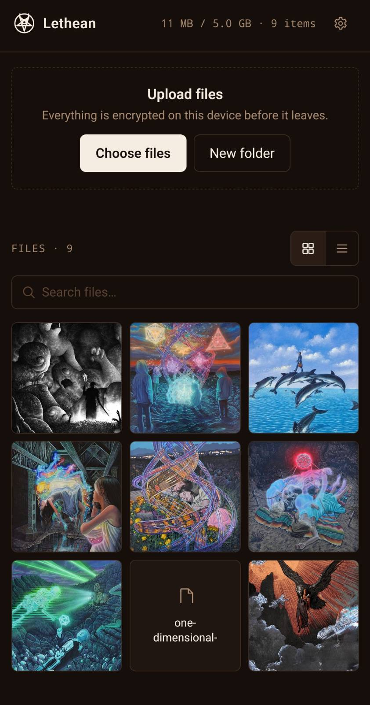

<div align="center">


## Anonymous Zero-Knowledge Encrypted Cloud Storage

</div>

Lethean is a zero-knowledge encrypted storage accountless web app. Your chosen password and an access token, issued by whoever operates the server, are the only credentials required to access your personal vault. Your password never leaves the browser; the access token is hashed locally into your vault's cryptographic salt and is also sent to the server as your upload credential. You can upload files and archives, including photos or videos, which you can browse and play (decrypted in memory). By design and for maximum security, the server only ever sees encrypted data, while only you hold the key.

> The name comes from the **River of Forgetfulness** in Greek mythology. In the Underworld, souls who drink from the river would lose all memory of their past lives before reincarnation.

## Features

- Built-in minimalist markdown editor
- FUSE client for mounting vault as a network drive
- Elegant and customizable UI
- AES-256-GCM for client-side encryption
- Ciphertext padding to hide file size metadata
- Argon2id for key derivation
- Minimum 12-character password, checked against a common-password list locally
- Duress code for wiping the vault under coercion, with an optional decoy vault
- Desktop and mobile apps (Tauri-based)

## Screenshots

<table align="center">
<tr>
<td align="center"><br/><sub>Desktop</sub></td>
<td align="center"><br/><sub>Mobile</sub></td>
</tr>
</table>

## How It Works

1. User types their password and access token.
2. The access token is hashed locally into a cryptographic salt, and combined with the password.
3. **That process produces one `masterKey`**, which is then split into two separate keys with two separate jobs:

| Key | What it does | Where it lives |
|---|---|---|
| `vaultId` | Acts like a "key card", user shows it to the server to prove they can access a vault. Think of it like an unguessable link: possession is access. | Sent to the server on every request |
| `wrappingKey` | Locks and unlocks the individual encryption key for each file user uploads. | Stays in the browser |

For the full design, see [`CRYPTOGRAPHY.md`](CRYPTOGRAPHY.md).

## Access Tokens

An access token, issued by whoever operates the server, is required both to unlock your vault (it's hashed locally into your vault's cryptographic salt) and to upload files (it's sent to the server as a bearer credential). Each token comes with a default 10 GB quota, and it's a one-time pairing, the first vault it's used with is the only vault it will ever work with.

Tokens are hashed (SHA-256) before they're written to disk, so a leaked `tokens.json` doesn't hand out upload tokens.

Server operators manage these tokens from the command line:

```bash
cd server
python manage_tokens.py create --label alice --quota-gb 15
python manage_tokens.py list
python manage_tokens.py revoke <token-or-id>
```

## Setup

```bash
git clone https://github.com/umutcamliyurt/Lethean.git
cd Lethean/client
npm install
npm run build
```

Then run the server:

```bash
cd ../server
python3.13 -m venv .venv
source .venv/bin/activate
python -m pip install --upgrade pip setuptools wheel
python -m pip install -r requirements.txt
uvicorn main:app --reload
```

Serves the API and client at `http://localhost:8000`.

## Desktop & Mobile Apps

The desktop and mobile apps are [Tauri](https://v2.tauri.app) wrappers around the same
`client/` code as the web app.

One-time setup (needs [Rust](https://www.rust-lang.org/tools/install) installed):

```bash
scripts/setup-tauri.sh
scripts/setup-tauri-android.sh
```

After that:

```bash
cd client
npm run tauri:build          # desktop
npm run tauri:android:build  # android
```

The release APK lands under `client/src-tauri/gen/android/app/build/outputs/apk/`.

## Threat Model

### Defends against:
- **Passive server compromise**: the adversary can read stored server data but cannot alter server responses, observe live operations, or control server behavior. Only encrypted data and encrypted metadata are stored, and file sizes remain hidden.
- Offline brute-force attacks against a stolen database
- Coerced unlock: the duress path is indistinguishable from the normal path at the network, storage, and UI levels
- Passive network eavesdropping during unlock attempts

### Does not defend against:
- **Active server compromise**: an adversary who can modify server-side data, tamper with responses, alter application behavior, or control the server. This includes replacing or modifying JavaScript delivered to the client, allowing the adversary to capture passwords and encryption keys.
  - This specific risk is drastically reduced for the desktop/mobile apps: their code ships in a
    build-time bundle rather than being fetched fresh from the server on every load, so a
    compromised server can't swap out the JavaScript the way it could for the web app. A
    compromised server can still see connection metadata.
- A compromised client, including a malicious browser, extension, or tampered JavaScript
- Weak or reused passwords
- Sustained forensic analysis of server-side metadata, including timing and access patterns.

## License

Distributed under the **MIT License**. See [`LICENSE`](LICENSE) for full terms.