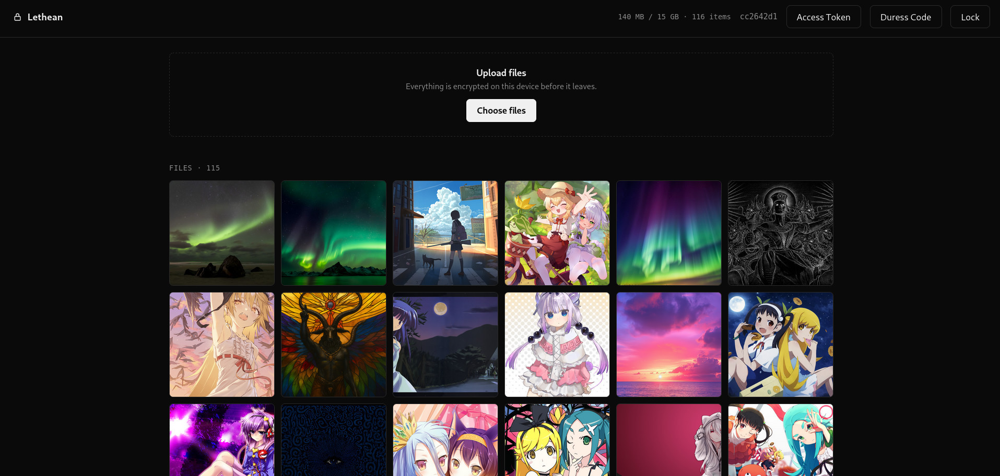

# Lethean

## Anonymous Zero-Knowledge Encrypted Cloud Storage

Lethean is a zero-knowledge encrypted storage app with no accounts, no
email. Your passphrase is the only credential and never leaves the browser. Upload photos and videos, browse them in a gallery, and play them
fully decrypted in memory, the server only ever sees ciphertext.

## Screenshot



## Features

- No user account required
- AES-256-GCM for client-side encryption
- Ciphertext padding to hide file size metadata
- Argon2id for key derivation
- Duress code for wiping the vault under coercion

## How it works

There is no registration or login endpoint. A passphrase is run through
Argon2id to derive a `masterKey`, which in turn derives:

- **`vaultId`**, sent to the server as a bearer capability on every
  request. It is not a username and is never validated against a
  database; possession of it *is* the access control, the same trust
  model as an unguessable share link.
- **`wrappingKey`**, stays in the browser and wraps each file's random
  content key.

Because `vaultId` only becomes available after the slow Argon2id step, an
attacker who steals the server's storage still has to pay full Argon2id
cost for every passphrase guess, there's no cheap shortcut in the
pipeline.

## Duress Code

A second passphrase can be configured to erase the real vault and open an
empty decoy in its place. Every code path, real passphrase, duress code,
or a random guess, runs through identical derivation and UI states, so
nothing about the flow reveals which was entered.

This indistinguishability extends to the network. Every unlock attempt,
not just the ones that trigger a wipe, sends the exact same `DELETE
/vault` request: the real vault's id on a duress match, or an unrelated
random id otherwise. Every vault also always stores *some* duress
config, real or decoy, so `localStorage` and unlock timing never reveal
whether a duress code was ever set up.

## Access tokens

Browsing a vault requires only its `vaultId`. Uploading additionally
requires an operator-issued access token (10 GB quota by default),
provisioned server-side:

```bash
cd backend
python manage_tokens.py create --label alice --quota-gb 15
python manage_tokens.py list
python manage_tokens.py revoke <token>
```

A freshly issued token binds permanently to the first vault that uploads
with it; a bound token cannot be reassigned.

## Running it

```bash
cd backend
pip install -r requirements.txt
uvicorn main:app --reload
```
Serves both the API and client at `http://localhost:8000`.

## Threat Model

### In scope

- **Server compromise / data theft.** The server (and anyone who steals
  its storage) only ever sees ciphertext, random-looking `vaultId`s, and
  wrapped content keys. It cannot derive `masterKey` or `wrappingKey`,
  and cannot tell real vaults from duress decoys.
- **Offline brute-force of a stolen database.** Every guess must pay the
  full Argon2id cost before a `vaultId` is even produced, since
  `vaultId` is itself derived from `masterKey`. There is no faster,
  pre-derivation check an attacker can run.
- **Coerced unlock ("rubber-hose" scenario).** A user forced to unlock
  their vault can supply the duress passphrase instead. This wipes the
  real vault and presents an empty decoy, and the network traffic,
  local storage, and UI are identical regardless of which passphrase
  path executes, so an observer at unlock time cannot tell a duress
  wipe happened, or that a duress code exists at all.
- **Network eavesdropping of unlock attempts.** Every unlock sends an
  identical `DELETE /vault` request shape whether or not it actually
  matches the duress code, so passive traffic inspection cannot
  distinguish a real wipe from a no-op.
- **Casual access-token leakage.** Tokens are quota-bound and permanently
  tied to the first vault that uses them, limiting the blast radius of a
  leaked upload token and letting operators revoke individual tokens.

### Out of scope / not defended against

- **Compromise of the client itself.** A malicious or compromised
  browser, extension, or endpoint (keylogger, memory scraper, tampered
  JS served by an attacker-controlled host) can capture the passphrase
  or derived keys directly. Zero-knowledge only holds if the client code
  the user is running is trustworthy.
- **Passphrase strength.** Argon2id raises the cost per guess but cannot
  turn a weak or reused passphrase into a strong secret. Users choosing
  low-entropy passphrases remain vulnerable to targeted or offline
  guessing given enough attacker resources.
- **`vaultId` interception in transit or at rest on the client.** Since
  possession of `vaultId` is the entire access control (bearer-capability
  model), anyone who obtains it — via a compromised device, browser
  history, shared link, referrer leakage, etc. — can browse that vault.
  This is an accepted trade-off of the no-account design, not a defect.
- **Duress under sustained, technical forensic analysis.** The design
  defeats casual or live observation (network capture, `localStorage`
  inspection, timing at the moment of unlock). It does not claim to
  defeat an adversary with deep forensic access to the server's storage
  and full request logs over time, who may be able to use metadata such
  as file sizes, upload timing, or access patterns to build suspicion
  even without breaking the cryptography.

## License

Distributed under the **MIT License**. See [`LICENSE`](LICENSE) for full terms.