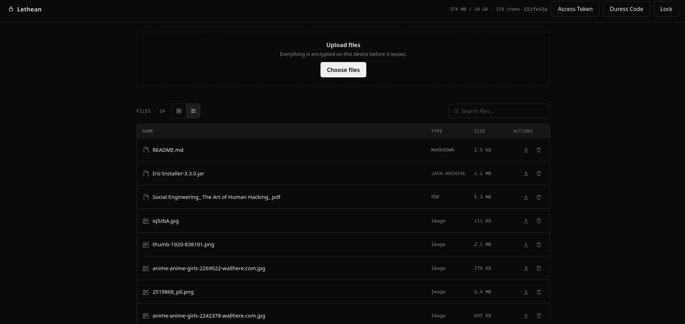

# Lethean

## Anonymous Zero-Knowledge Encrypted Cloud Storage

Lethean is a zero-knowledge encrypted storage app with no accounts. Your chosen password and the salt are the only credentials required to access your personal vault. These credentials never leave the browser. You can upload files and archives, including photos or videos, which you can browse and play (decrypted in memory). By design and for maximum security, the server only ever sees encrypted data, while only you hold the key.

> The name comes from the **River of Forgetfulness** in Greek mythology. In the Underworld, souls who drink from the river would lose all memory of their past lives before reincarnation.



## Features

- No user account required
- Elegant and customizable UI
- AES-256-GCM for client-side encryption
- Ciphertext padding to hide file size metadata
- Argon2id for key derivation with per-vault salt
- Minimum 12-character password, checked against a common-password list locally
- Duress code for wiping the vault under coercion, with an optional decoy vault

## How It Works

Everything starts with the password. Here's the chain, step by step:

1. **User types their password.** It never leaves the browser.
2. **It's combined with a salt** (a random value unique to the vault) and run through **Argon2id**, a slow, memory-hard hashing function designed to make guessing passwords expensive.
3. **That process produces one `masterKey`**, which is then split into two separate keys with two separate jobs:

| Key | What it does | Where it lives |
|---|---|---|
| `vaultId` | Acts like a "key card", user shows it to the server to prove they can access a vault. Think of it like an unguessable link: possession is access. | Sent to the server on every request |
| `wrappingKey` | Locks and unlocks the individual encryption key for each file user uploads. | Stays in the browser |

**Why the salt matters:** the salt itself doesn't need to be secret, but without it, the same password won't produce the same `masterKey`. So if two people happen to pick the same password, their vaults still end up completely unrelated, different salt, different keys.

**Why this resists brute-forcing:** because `vaultId` only exists after the Argon2id step, someone who steals the server's data can't shortcut anything. Every single password guess still has to pay the full Argon2id cost, there's no faster path in.

## Duress Code

Think of the duress code as a second, secret password that opens a decoy vault instead of the real one, and silently destroys the real one in the process.

Here's what makes it safe to use under coercion: if someone forces user to "unlock their vault," there's no way for them to tell which of these three things actually happened:

- User entered their real password --> real vault opens normally
- User entered their duress code --> real vault is wiped, a decoy opens instead
- User entered the wrong password --> nothing happens, an empty vault opens instead

All three cases look identical from the outside, same derivation steps happen in the browser, same network requests go out, even the exact same `DELETE /vault` request shape gets sent to the server every time. Nothing about the traffic, timing, or server behavior reveals which one occurred.

An empty decoy vault can itself be a tell, "let me in" followed by a suspiciously bare vault invites questions. So user can pre-stock the decoy with a handful of harmless files ahead of time, from inside the real vault's settings.

This also means an observer can't even confirm that a duress code exists for a given vault, the possibility is baked in silently, not something that shows up as a special "duress mode" anywhere.

## Access Tokens

Uploading files requires an access token, issued by whoever operates the server. Each token comes with a default 10 GB quota, and it's a one-time pairing, the first vault it's used with is the only vault it will ever work with.

Tokens are hashed (SHA-256) before they're written to disk, so a leaked `tokens.json` doesn't hand out upload tokens.

Server operators manage these tokens from the command line:

```bash
cd backend
python manage_tokens.py create --label alice --quota-gb 15     # issue a real token + a matching decoy token
python manage_tokens.py list                                   # see all tokens
python manage_tokens.py revoke <token-or-id>                   # disable a token
python manage_tokens.py migrate                                # migration to hashed storage
```

`create` issues two tokens by default: one for the real vault, and one for the decoy vault used by the Duress Code feature, both with the same quota, so the decoy is never distinguishable by a smaller number. Pass `--no-decoy` to skip the second one.

## Setup

```bash
git clone https://github.com/umutcamliyurt/Lethean.git
cd Lethean/client
npm install
npm run build
```

Then run the backend:

```bash
cd ../backend
pip install -r requirements.txt
uvicorn main:app --reload
```

Serves the API and client at `http://localhost:8000`.

## Threat Model

**Defends against:**
- Server compromise: only encrypted data and encrypted metadata are stored. File size also remains hidden from adversary
- Offline brute-force of a stolen database
- Coerced unlock, duress path is indistinguishable at the network, storage, and UI level
- Passive network eavesdropping of unlock attempts

**Does not defend against:**
- A compromised client (malicious browser, extension, or tampered JS)
- Weak or reused passwords
- Sustained forensic analysis of server-side metadata (timing, access patterns)

## License

Distributed under the **MIT License**. See [`LICENSE`](LICENSE) for full terms.